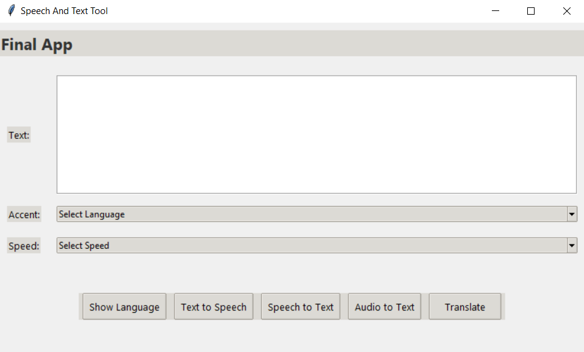

# Speech-and-Text-App

Speech and Text Python App

## Hướng dẫn cài đặt

1. Cài đặt các gói cần thiết:
pip install -r requirements.txt
2. Khởi chạy App
python Final_App.py

## Tính năng

1. Convert Text to Speech
Chuyển đổi văn bản thành giọng nói với nhiều loại ngôn ngữ khác nhau và tốc độ đọc khác nhau
2. Convert Speech to Text
Chuyển đổi giọng nói thành văn bản với ngôn ngữ hỗ trợ Tiếng Việt
3. Transcribe File Audio to Text
Đọc file âm thanh đầu vào và chuyển đổi thành text, hỗ trợ Tiếng Việt và Tiếng Anh
4. Translate text
Dịch văn bản với nhiều loại ngôn ngữ khác nhau

## Giao diện chính

